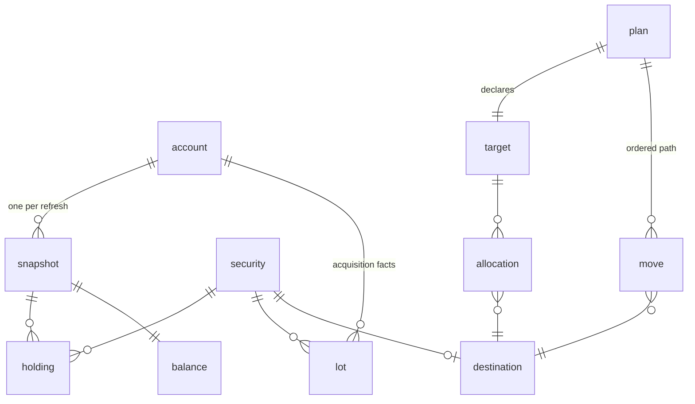

# investment-portfolio-service

Everything in [Evergreen BBD](../../docs/design/evergreen-bbd-poc.md) that isn't a screen: the
portfolio as the broker reports it, the plans over it, and the arithmetic between them. The Expo
app is a thin client and Claude reaches the same operations over MCP — no model runs in here
([ADR-0003](../../docs/adr/0003-no-llm-in-the-app.md)) and nothing places trades.

```bash
cp .env.example .env
pnpm db:up
pnpm db:migrate
pnpm dev                 # :4000
```

`pnpm db:reset` drops the volume; `pnpm db:down` keeps it.

## The data model



**A snapshot is the unit of "as of".** Holdings and balances hang off a `snapshot`, never off the
account, so every number traces to one refresh and change over time is a query. Anything the
broker restates on each sync belongs under `snapshot`.

**A lot is never restated, so it isn't snapshot-scoped.** An acquisition is a fact about a day.
Re-parenting lots on every sync would erase the CSV backfill, which is their only source — the
broker returns `tax_lots` empty on every position.

Where the broker's shape and the domain's disagree, the domain wins and the conversion happens
once, at ingestion. `balance.cash` is the signed figure SnapTrade reports; `balance.margin_balance`
is the positive liability LTV is computed against, derived as `max(0, -cash)` because SnapTrade
carries no margin field. Staleness is two columns — `holdings_last_synced_at` and
`transactions_last_synced_on` — because the broker syncs those independently and they run days
apart.

**A `destination` is where a dollar can go, and it is why this is not a rebalancer.** A rebalancer
assumes every freed dollar buys something. Retiring margin debt is a certain, tax-free return that
competes with any purchase, so `margin_paydown` and `cash` are destinations alongside securities,
and a `move` goes `into` or `out_of` one rather than buying or selling. "Sell VOO, pay the loan
down with the proceeds" is two moves on one path; under buy/sell it has no representation.

Margin paydown and cash are singleton rows, seeded at boot by `src/db/core-destinations.ts` — they
exist whether or not a plan named them. Exactly one plan is `active` at a time, held by a partial
unique index rather than by the accept path, so two racing writers still produce one answer.

## Changing the schema

Tables live in `src/db/schema/`, one file per area, re-exported from `index.ts`. After an edit:

```bash
pnpm db:generate
pnpm db:migrate
```

The generated SQL is committed and `src/db/migrate.ts` applies it on boot. `drizzle-kit push`
diffs against whatever the database happens to be, so it is never used here.

Two rules the tests enforce:

- **Column types come from `src/db/columns.ts`.** Exactness is why this is Postgres, and the easy
  way to lose it is on the read side — `mode: 'number'` leaves the column exact and hands you a
  double. Values arrive as strings; do arithmetic with a decimal library.
- **`_at` is an instant, `_on` is a calendar day.** Which tax year a lot landed in must not depend
  on the reader's timezone.

`casing: 'snake_case'` is set in both `drizzle.config.ts` and `src/db/client.ts`. The two have to
agree or generated SQL stops matching what the client queries.

## Tests

```bash
pnpm db:up && pnpm test
```

With no reachable `DATABASE_URL` the integration tests skip themselves and the run still reports
green — `vitest.config.ts` loads `.env` to close that hole, since vitest has no `--env-file`. They
run against `<database>_test` suffixed with the worktree name and drop tables as they go.
