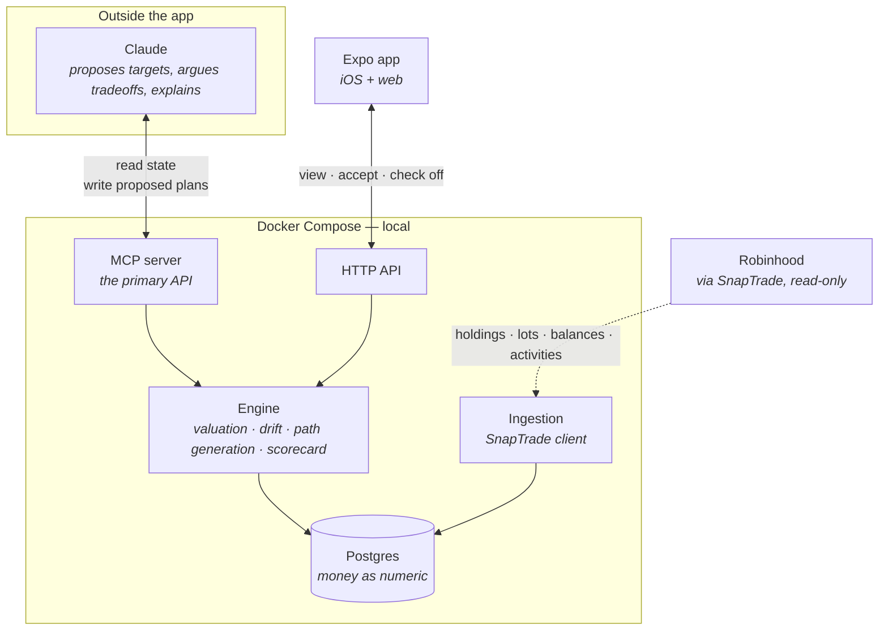
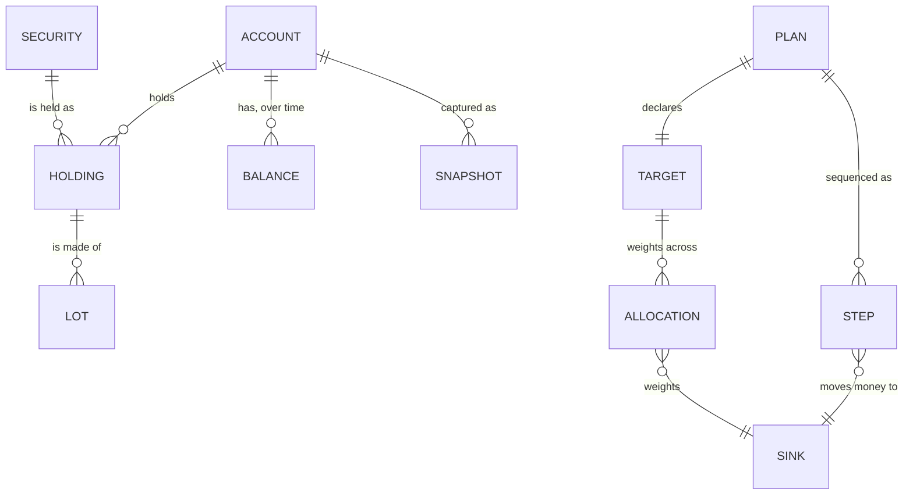

# Evergreen BBD — architecture and design (POC)

Status: design agreed 2026-08-04. Scope here is the **proof-of-concept** only.
Vocabulary: [`CONTEXT.md`](../../CONTEXT.md). Decisions: [ADR-0003](../adr/0003-no-llm-in-the-app.md),
[ADR-0004](../adr/0004-service-owned-postgres.md), [ADR-0005](../adr/0005-plan-is-target-plus-path.md).

## The problem

Evan is moving from earning a paycheck to living out of a Robinhood margin account: reallocate a
~$500k portfolio toward income, turn on margin, pay expenses from it, and reach the point where
portfolio income covers expenses and services the loan. He has never done any of this before. The
app is the instrument he learns on and executes with.

Three questions define it, in the order they become urgent:

1. **What do I sell and buy?** — reallocation, and the tax cost of getting there
2. **How do I start living off margin?** — setup, guardrails, safe draw
3. **When does income beat expenses?** — projection to coverage

The POC answers (1) and shows the headline numbers for (2). (3) is deferred.

## Why this is not a dashboard

A prior attempt at this — a Notion build with twelve databases, working formulas, and a real data
import — failed. Not for lack of correctness; the math was right. It failed because **it modeled
steady state.** It could report that income coverage was 48% and that growth was 5% over target.
It could not say what to do about either, because the thing being lived through is not a steady
state — it is a multi-year sequenced transition.

Its second failure followed from the first: with nothing to plan against, the product became
logging. Trades, expenses, income events, all entered by hand, all going stale.

Two rules fall out, and they constrain everything below.

- **Logging is a side effect, never the product.** Anything the app asks you to type is a design
  smell to be removed, not a feature to be polished.
- **Every screen answers "what now," not "what happened."** History exists to make the next
  decision better.

## Architecture

The app owns state, arithmetic, and workflow. Claude — running outside, in Claude Code or the
desktop app — owns judgment, and reaches the app through MCP. There is no model inside the
product. See [ADR-0003](../adr/0003-no-llm-in-the-app.md).

**The MCP surface is the real API.** The HTTP API is a second consumer of the same operations, not
the primary one. Designing MCP-first keeps the app honest: if an operation cannot be expressed as a
tool call, the coach cannot drive it.

**The app never places trades.** It tells you what to do; you execute in Robinhood. Lot selection
at sale time happens in Robinhood's UI. This is a hard boundary — the SnapTrade Robinhood
integration is read-only, and that suits the design rather than constraining it.

### Why a service and not on-device storage

Two consumers need the same data. `expo-sqlite` lives on the device and an MCP server is a Node
process; they cannot share a file. On-device storage means two databases and a sync problem, for a
single user, on day one. See [ADR-0004](../adr/0004-service-owned-postgres.md).

Stack: Postgres 17 in Docker Compose, Drizzle for schema and migrations, TypeScript throughout,
money as `numeric` — never float.

## Domain model

**Portfolio state** is what the brokerage says is true, plus when it said so.

| Entity | Carries |
|---|---|
| `account` | the one Robinhood Individual/Margin account; **`last_synced_at`** |
| `security` | ticker, name, asset class, distribution yield, marginability |
| `holding` | quantity and market value of one security, as of a moment |
| `lot` | quantity, acquisition date, price per share, cost basis |
| `balance` | cash, margin balance, buying power, total value |
| `snapshot` | the above, retained over time so change is measurable |

`last_synced_at` is first-class and surfaced in the UI. A plan computed against six-week-old
holdings is worse than no plan, and the app should say so rather than quietly present stale
arithmetic as fact.

**Lots are not optional.** "Which shares do I sell" cannot be answered from average cost, and the
staged liquidation this app exists to run is entirely a question of which shares, in which tax
year. This is the one place the design deliberately costs more than the Notion attempt, which
explicitly scoped lots out as "belongs in software." This is that software.

**Planning** is the half that makes it a coach.

| Entity | Carries |
|---|---|
| `plan` | name, status: `draft → candidate → active → completed \| abandoned` |
| `target` | the declarative end state — weights, rules, margin policy |
| `allocation` | one weight against one sink |
| `step` | one action: sequence, sink, amount, earliest date, dependency, status, executed date |
| `sink` | where a dollar goes — a security, **paying down margin**, or **holding cash** |

**Sinks are why this is not a rebalancer.** A rebalancer assumes every freed dollar buys something.
Early in this transition it may not: retiring margin debt at ~5.5% is a certain, tax-free return,
and it competes directly with buying a 12% distribution that is taxable and may partly be your own
capital returned. A model where steps only buy and sell cannot express that trade, so it would be
wrong. Cash is a sink for the same reason.

Exactly one plan is `active`. Accepting a plan is the single write that turns a proposal into a
commitment, and it is the moment the app starts being accountable for progress.

## The engine

All arithmetic lives here, shared by MCP and HTTP. Plain TypeScript, testable without a simulator
or a database round trip.

**Valuation** — current allocation by security and by category; total value, margin balance, LTV,
equity %, buying power.

**Drift** — current allocation against the active target, per sink. Drift is expected. Enough of it
means the path no longer reaches the target and should be regenerated.

**Path generation** — the diff between current holdings and a target, sequenced into steps.
Sequencing matters: liquidation precedes purchase, some steps gate on tax year, some gate on margin
being live.

**Scorecard** — the fixed comparison used to score any target, so comparison is honest:

- projected annual income
- realized gains incurred to reach it
- upside retained
- resulting LTV and equity %
- months to coverage

**Tax is an annotation, not a solver.** A sell step says "realizes ~$12k in long-term gains." The
engine does not optimize against tax brackets, model wash sales, or constrain what you may buy. The
number informs the decision; it does not make it. This is a deliberate limit — a full tax engine
was scoped out as over-correction, and reintroducing one should be a conscious decision, not drift.

## MCP surface

The operations the coach drives. Read tools answer questions; write tools change commitments.

**Read** — `get_portfolio_state`, `get_holdings`, `get_lots`, `get_balances`, `get_drift`,
`list_plans`, `get_plan`, `score_target`, `get_progress`

**Write** — `propose_plan`, `accept_plan`, `mark_step_done`, `refresh_from_broker`

`score_target` is the load-bearing one: it lets Claude evaluate a hypothetical target *without*
creating a plan, which is what makes "what if I held QQQ and trimmed instead of buying QQQI" a
question with an answer rather than an opinion. Both sides go through the same engine.

`refresh_from_broker` makes data currency an operation rather than a chore.

## Ingestion

**SnapTrade**, read-only OAuth, as the primary source — pending a spike (below).

Robinhood publishes no equities API; the crypto API is the only official one. Every path is either
an aggregator or reverse-engineered. The existing `robinhood-mcp` wraps `robin_stocks` and is
missing three things this app needs:

| Gap | Consequence |
|---|---|
| No tax lots — `average_buy_price` only | cannot answer which shares to sell |
| No cash or margin balance | **the margin command center cannot read the margin balance** |
| No order history | no fallback route to reconstructing basis |

SnapTrade covers all three: positions, balances including buying power, intraday orders, daily
activities, option positions, and tax lots carrying `original_purchase_date`, price per share, and
lot cost basis. Free below five connections; $1.50 per connected user per month beyond. It also
removes password storage, the `~/.tokens/robinhood.pickle` cache, and the device-approval hang that
the vault's credentials page documents at length.

**Two unknowns gate this**, which is why it is a spike rather than a decision: tax lots are disabled
by default and paid-plan only, and SnapTrade's docs do not confirm that the *Robinhood* connector
returns lots at all.

**Fallback if lots do not arrive:** `robin_stocks` for live state, plus a one-time CSV backfill from
Robinhood's Reports and Statements export for basis on the positions being liquidated. Those are
historical facts that never change — import once. This is a fine outcome and costs nothing.

**Reconstructing lots from order history does not work here.** Taxable #2 was merged into the
Individual/Margin account, so those positions' purchases happened in an account that no longer
exists. The receiving account's order history never saw them. DRIP shares and wash-sale adjustments
have the same problem. Basis has to come from the broker or from a statement, not from arithmetic.

Credentials follow the standard pattern: `op://Agents/SnapTrade/...`, injected at runtime, never in
config.

## POC scope

**Done means:** two candidate targets compared on the scorecard, one accepted, an order list
produced that Evan would actually enter into Robinhood, progress tracked as he executes it — and
total value, LTV, equity %, and buying power live on screen.

**In**

- SnapTrade ingestion: holdings, lots, balances, activities
- Postgres schema and the engine
- Plan model with lifecycle; target scoring; path generation
- MCP server, read and write
- Expo screens: portfolio state, plan comparison, active plan with checkable steps
- Staleness surfaced everywhere a number is shown

**Out**

- Projection to coverage, and the return model it needs — phase 3
- Margin setup coaching and draw guardrails — phase 2
- Generated reports and notifications
- Options and wheel tracking
- Auth, multi-user, hosting, cloud deployment
- Trade execution — permanently out
- Retirement accounts — permanently out

## Open questions

- Does the SnapTrade Robinhood connector return tax lots, and at what plan tier? Blocks the
  ingestion decision; first issue.
- What are the scorecard's exact columns and how is "months to coverage" computed without the
  deferred return model? Likely a stated-assumption input rather than a projection.
- What is the initial sink taxonomy — individual securities, or categories with securities inside
  them? Affects whether targets are expressed as "15% QQQI" or "45% income engine."
- Covered-call funds versus holding the index and trimming: an open strategy question, and the
  first real test of whether `score_target` earns its keep.
